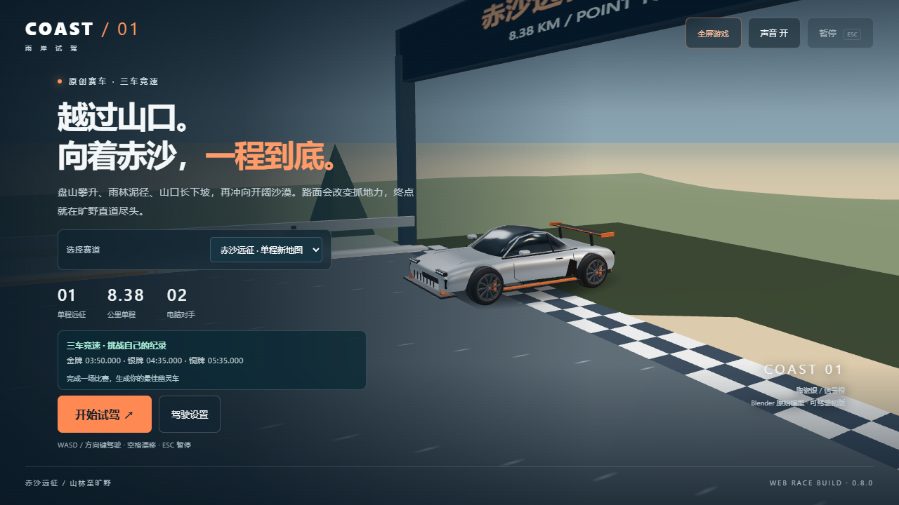

# 雨岸赛车 / Rain Coast

一款原创公路竞速游戏。驾驶银色跑车，在三张地图上与两名驾驶风格不同的 AI 对手竞速。「赤沙远征」是约 8.38 公里的单程地图：盘山公路、雨林泥地、长坡下行、沙漠与宽阔冲线区。雨林泥地会降低抓地力、加速和制动效果。「云脊天路」约 6.10 公里一圈，经典「雨岸远征」也完整保留。

## 打开即玩

**[进入雨岸赛车网页版](https://kevinkaslana093.github.io/rain-coast/)**

支持电脑键盘与手机触屏操作，无需下载或安装。驾驶设置中可调整转向灵敏度、画质、弯道提示与最佳成绩幽灵，并自动保存。每张地图提供金银铜牌目标和四段计时，用自己的最佳路线作为下一场的半透明幽灵车。背景音乐包含 Tension、Neon Heartbreak、Redline Memory 和 Turbo Pop 2009。每场随机开曲，播完自动随机换曲，每轮四首都能播放且不会连续重复。手机点「全屏开始」可尝试进入沉浸全屏，也可用右上角「全屏游戏 / 退出全屏」切换。横屏菜单支持滚动，开始按钮固定在底部。手机可在驾驶设置中启用「倾斜手机」，授权后横握手机并校准；油门、刹车和备用左右转向仍使用屏幕按钮。不支持传感器的浏览器可使用触屏模式。

## 下载试玩

前往 [Releases](../../releases/latest) 下载 `RainCoast-Windows-v0.6.1.zip`。

1. 完整解压 ZIP。
2. 双击 `RainCoast.exe`。
3. 点击游戏窗口，按 `W` 或 `↑` 开始比赛。

无需安装 Unreal Engine。目前提供 Windows 64 位版本。

Release 同时提供 macOS 构建就绪工程；它需要在 Mac 上用 UE 5.8 和 Xcode 编译，不是已经编译好的 `.app`。

## 操作

| 按键 | 功能 |
| --- | --- |
| W / ↑ | 开始比赛、加速 |
| S / ↓ | 刹车、倒车 |
| A / D 或 ← / → | 转向 |
| Space | 漂移 |
| R | 回到赛道，增加 3 秒 |
| N | 重新开始 |
| Esc | 暂停 / 继续 |
| Tab | 切换镜头 |
| F1 | 自动驾驶演示 / 切回手动 |
| Alt + F4 | 退出 |

## 当前版本

网页版 v0.8.0 升级为三车竞速，加入两种 AI 驾驶策略、最佳成绩幽灵、四段计时、奖牌挑战、路面与弯道提示，以及手机动态画质。泥地与沙地的抓地变化采用平滑过渡。`v0.6.1` Windows 下载包仍是离线单人试玩版：两圈竞速，挑战蓝色 AI 对手。真人联机暂未加入。

若启动时提示缺少 Visual C++ 运行组件，请运行游戏包内的：

`Engine/Extras/Redist/en-us/vc_redist.x64.exe`

欢迎在 [Issues](../../issues) 反馈操控手感、赛道问题、电脑配置和运行情况。

---

## English

Rain Coast is an original racing game with three selectable courses. Red Sand Expedition is an 8.38 km point-to-point journey through mountain switchbacks, rainforest mud, a long descent, and desert straights. Mud changes tire grip, acceleration, and braking. Skyline Road and the classic Rain Coast loop remain available.

Download `RainCoast-Windows-v0.6.1.zip` from [Releases](../../releases/latest), extract the entire ZIP, and launch `RainCoast.exe`. Unreal Engine is not required. Windows x64 only.

Press `W` or `Up` to start and accelerate. Use `S`/`Down` to brake, `A`/`D` or arrow keys to steer, `Space` to drift, `R` to recover, `N` to restart, `Esc` to pause, `Tab` to change camera, and `F1` to toggle autodrive.

This is currently an offline single-player preview. Online multiplayer is not included yet.

The release also includes a macOS build-ready UE5 project. It requires UE 5.8 and Xcode on a Mac and is not a precompiled `.app`.

**[Play Rain Coast in your browser](https://kevinkaslana093.github.io/rain-coast/)** — no download required. The browser version features three-car races, two distinct AI strategies, personal-best ghosts, split times, medal goals, pace notes, adaptive mobile graphics, calibrated phone tilt steering, touch buttons, and adjustable steering sensitivity. Four background tracks play in shuffled rounds: Tension, Neon Heartbreak, Redline Memory, and Turbo Pop 2009. Each round includes every track without consecutive repeats.

© 2026 Rain Coast. All rights reserved.
